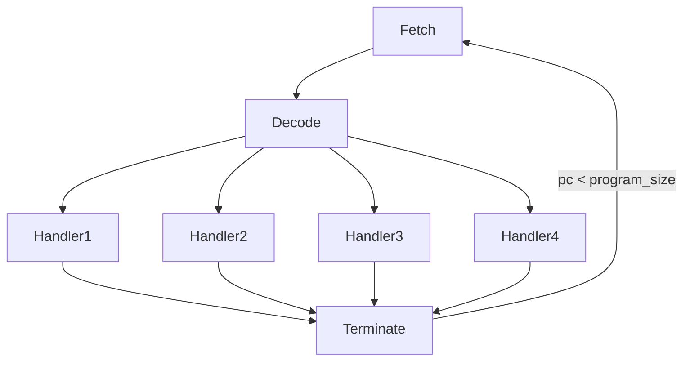

# Automating Binary Deobfuscation Processes: Dynamic Taint Analysis and Symbolic Execution

Content for the presentation given at TOBB university, Malware Analysis and Reverse Engineering Workshop https://etuguvenlik.wordpress.com/ .

## Authors
Berk Cem Goksel

Usama Saqib

# Introduction
In this article we describe a technique for deobfuscating virtualized binaries. Code virtualization is a well known obfuscation technique, where important
portions of the code are written is a custom ISA. This is then interpreted at runtime using a virtual machine [1]. This approach significantly increases the complexity a reverse engineer has to deal with. In order to reverse the binary, the analyst must reverse the VM machinery and understand the VM semantics. 

For deobfuscation, we set our goal as algorithm recovery, i.e. what transformations are applied on the relevant data. We used a simplified version of the approach described in the paper "Symbolic deobfuscation: from virtualized code back to the original" [2].
The following sections describe the virtual machine implemented. We then describe our approach, and the tool used in the process. Finally, we discuss some mitigations that can be applied to this obufuscation to make it more resiliant against this category of attack.

# Machine Description
This is an informal design for a stack interpreter that manipulates 32 bit signed integers and understands a few instructions.

Each instruction has an index in the code, starting from 0, and an optional integer argument, as in 3 JMPZ 5 which is the forth instruction of the listing, named JMPZ with a single argument 5.

```
**Instructions**
READ: reads an integer on stdin and push the value on the stack, or exit if input is invalid

WRITE: pops the top value of the stack, and prints it on stdout

DUP: duplicate the value on top of the stack

MUL: pops the two top value of the stack, multiply them and push the result on top of the stack

ADD: pops the two top value of the stack, add them and push the result on top of the stack

SUB: pops the two top value of the stack, sub the TOP with the SECOND and push the result on the stack

GT: LT: EQ: pops the two top values from the stack, compare them for TOP > SECOND, TOP < SECOND or TOP == SECOND and push the result as 0 or 1 on the stack

JMPZ: pops the two top value of the stack. Jump to the <n>th instruction, where <n> was the first value on the stack, if the top value is null. Otherwise just drop these two values

PUSH <n>: push the integer value <n> on the stack

POP <n>: pop n value from the stack

ROT <n>: perform a circular rotation on the first n value of the stack toward the top for instance the stack : BOTTOM [1,2,4,8] TOP becomes BOTTOM [1, 8, 2, 4] TOP after ROT 3
```

# Stack Interpreter
Our implementation of the stack interpreter in based on the generic __fetch, decode, dispatch, loop__ virtual machine , as shown in the figure below.
It comprises of five principle components:
1. **Fetch**: The instructions are fetched from the machine's program memory, as indicated by a program counter.
2. **Decode**: The instruction is decoded and and the control flow is passed to the relevant handler.
3. **Handler**: Each instruction has a handler which implements its logic. The handler interacts with the stack memory and updates it as required.
4. **Terminate**: The machine terminates once all the instrucitons have been executed, or an illegal instruction is met.


## Factorial Program
The following is a brief explanation of the main parts of the factorial program.

1. Check whether the input is greater than 0. Input less than zero is considered undefined.
2. This is the factorial function. At the beginning of each iteration the structure of the stack is as follows
    > | original_value | running_sum | counter|

   The iteration begins by checking if the counter is less than the original value. If so then, it is copied, and the copy is multiplied with the running sum. The counter is incremented and the iteration begins again.


```
#1
READ
DUP
PUSH 0
LT
PUSH 28
JMPZ
DUP
PUSH 1
# 2
ROT 2
ROT 3
DUP
ROT 3
ROT 2
DUP
ROT 5
GT
PUSH 27
JMPZ
DUP
ROT 3
MUL
ROT 2
PUSH 1
ADD
PUSH 0
PUSH 8
JMPZ
# 3
ROT 2
WRITE

```


# Deobfuscation
The attack depends on two main techniques: 
- Dynamic Taint Analysis for recovering the pertinent portion of the virtual machine.
- Backward slicing, using symbolic execution, in order to seperate the transformations from the VM machinery.

We used libdft to perform Dynamic Taint Analysis [3]. libdft is based on the Dynamic Binary Instrumentation framework, Pin. It uses Pin to build its taint propogation engine. libdft provides support only for 32-bit binaries. We taint the data provided, via stdin, by the user, and track all 'mov' instructions which use the tainted data in it's operands. This done so that the execution between points where the data is inputted by the user, and where the data is outputted by the program, can be marked. The disassembled binary is used to attest that the last 'mov' happens before the call to the print function. This way we can recover the appropriate entry point, and target for the backward slicing.

In order to perform backward slicing, we use the symbolic execution facilities provided by triton [4].

In order to configure the emulation environment of the symbolic execution engine we identified the memory regions that determined execution. In a real life scenario, where extra obfuscation is likely to be performed on the VM itself, this approach is not desirable. An automated solution using a DBI framework for tracking memory would be better suited. However, this seemed overkill for the current problem.

The following were the key memory areas identified, and concretized.
- Pointer to the Interpreter object.
- The values of the private variable of the object. These are as follows.
    -  Stack memory.
    - Program memory, i.e. the instructions to be emulated.
    - The program counter, that indicates the next instruction to be executed.
    - The stack pointer, which tracks the stack memory.
- The jump table, which held address of the intruction handlers.
- The virtualized program.
- The loop condition variable.

## Results 
Using DTA the following instructions were identified as the entry point and the target for backward slicing.

```asm
0x8048a3e: mov eax, dword ptr [ebp-0x90]
.
.
.
0x8048a6c: mov dword ptr [ebp-0x80], eax
```

The instruction at 0x8048a3e loaded the data read from the user into eax, and the instruction at 0x8048a6c stored the data to be printed into the memory region. Therefore, the backward slice is to be computed for eax with the entry_point:0x8048a3e and the target:0x8048a6c.

The output contains long sequences of 'mov' instructions interspersed by instructions performing computation. Filtering out the 'mov' instructions gives us a clear picture.

```x86
0x8048b12: imul eax, dword ptr [ebp - 0x74]
0x8048b82: add eax, edx
0x8048b12: imul eax, dword ptr [ebp - 0x74]
0x8048b82: add eax, edx
0x8048b12: imul eax, dword ptr [ebp - 0x74]
0x8048b82: add eax, edx
0x8048b12: imul eax, dword ptr [ebp - 0x74]
```

As we can see the code iterates over the 'imul' and 'add' instructions. Using a debugger we can see that the imul instruction multiplies the user supplied data, with an integer, which is subsequently incremented by one, in each iteration. Following through with the execution we see that the multiplications follows the pattern of the factorial function.

# Attack Mitigation
This attack depends upon Dynamic Taint Analysis to identify the region of code where the computation is performed. Therefore, the goal of this mitigation is to prevent this technique from identifying the correct region for backward slicing.

Implicit flows occur when data flow is influenced by control structures such as branches. Implicit flows are difficult to accout for in taint analysis, and most systems ignore them, including libdft. Therefore, we can leverage this weakness to improve the security of our obfuscation function. If the trace is used to guide the backward slice, only the portion prior to the introduction of implicit flow will be available. As is explained below, the factorial algorithm executes after the point of the implicit flow.

The program is also show below.

1. This portion performs the checks to see if the input is legal. An input of less than zero can be considered to return an undefined result.
2. This portion performs the implicit flow. Instead of performing computations on the tainted input, the program increments a 'clean' value to the input value, and removes the tainted value from its stack.
3. The factorial function uses the 'clean' data for computation.

```
# 1
READ
DUP
PUSH 0
LT
DUP
PUSH 42
JMPZ
# 2
POP 1
DUP
PUSH 0
PUSH 1
ADD
DUP
ROT 3
ROT 2
DUP
ROT 4
EQ
PUSH 10
JMPZ
ROT 3
POP 2
PUSH 1
PUSH 1
# 3
DUP
ROT 3
MUL
ROT 2
PUSH 1
ADD
ROT 2
ROT 3
DUP
ROT 3
ROT 2
DUP
ROT 5
ROT 2
GT
PUSH 24
JMPZ
ROT 2
WRITE
```

# References
[1] “What is VMProtect?,” VMProtect Software Protection. [Online]. Available: http://vmpsoft.com/. [Accessed: 08-Dec-2019]

[2]  J. Salwan and M.-L. P. Sébastien Bardin, “Symbolic Deobfuscation: From Virtualized Code Back to the Original,” SpringerLink, 28-Jun-2018. [Online]. Available: https://link.springer.com/chapter/10.1007/978-3-319-93411-2_17. [Accessed: 08-Dec-2019]. 

[3] “libdft,” libdft: Practical Dynamic Data Flow Tracking for Commodity Systems. [Online]. Available: http://www.cs.columbia.edu/~vpk/research/libdft/. [Accessed: 08-Dec-2019]. 

[4] Quarkslab, “Internal Views,” Triton. [Online]. Available: https://triton.quarkslab.com/. [Accessed: 08-Dec-2019]. 
